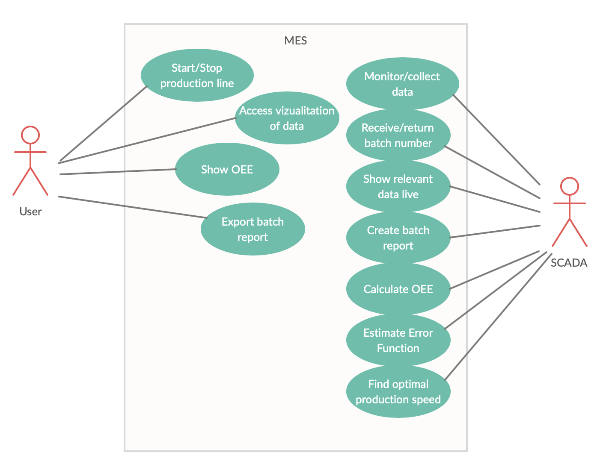

# Initial Requirement Analysis

## Summary of requirements
The groups proposed solution will adhere to the requirements given by the brewery Refslevbæk Bryghus A/S.

The MES must be able to control the brewery’s production. It must be able to start and stop the production line, as well as monitor the production and collect data from the production line. The data must be stored for further analysis.
The MES must be able to keep tract of the batches that the new machine is producing, as well as collect various data from the machine that is associated with the current batch number. After a finished batch production, the MES must be able to produce a batch report of the produced batch. The report must contain the following.
- Batch ID
- Product type
- Amount of products (total, defect and acceptable)
- Amount of time used in the different states
- Logging of temperature over the production time
- Logging of timidity over the production time

The MES/SCADA system must be able to monitor the production and display live relevant data from the machine.
The documentation of the system must contain an illustration that defines the different components in the setup, in relation to the ISA88^1213 Part 1 Physical Hierarchy model. The system must have a visualization that can be accessed and used to display the production data. The system must be able to collect the necessary data from the machine and calculate the OEE^131516 of the machine. The OEE must be available to be displayed by the system. The system must be able to estimate the error function associated with the different products.
The system must be able to find the optimal production speed for each product type, based on an error simulation and the appertaining graph upon which the error simulation is built.

## List of requirements
| ID  	| Name                     	| Description                                                                                                                                                 	|
|-----	|--------------------------	|-------------------------------------------------------------------------------------------------------------------------------------------------------------	|
| R01 	| Control production line  	| Start/stop production line                                                                                                                                  	|
| R02 	| Monitor production       	| Monitor production (collect data and store said data)                                                                                                       	|
| R03 	| Administer batches       	| Keep track of batches (batch ID)                                                                                                                            	|
| R04 	| Store batch info         	| Collect various data associated with current batch number from machine                                                                                      	|
| R05 	| Batch ID                 	| Receive a batch number and return the batch number when the batch has been completed                                                                        	|
| R06 	| Live data                	| Monitor and display live relevant data from the machine                                                                                                     	|
| R07 	| Batch report             	| Produce a batch report (PDF/dashboard style format)                                                                                                         	|
| R08 	| Documentation            	| Documentation must contain an illustration that defines the different components in the setup in relation to the ISA88^1213 Part 1 Physical Hierarchy model 	|
| R09 	| Visualization            	| Visualization that can be accessed and used to display the production data                                                                                  	|
| R10 	| OEE                      	| Collect necessary data from the machine and calculate the OEE. OEE must be available to be displayed by the system                                          	|
| R11 	| Estimate error function  	| Estimate the error function associated with the products                                                                                                    	|
| R12 	| Optimal Production speed 	| Estimate the optimal production speed for each product type                                                                                                 	|

## Prioritization of requirements
The group has decided that at the current state, every requirement is a must have. A further prioritization of requirements will occur, when we split the requirements into issues.

## Use Case Diagram

## Supplementary Requirements
| FURPS          	| Demands                                                      	|
|----------------	|--------------------------------------------------------------	|
| Functionality  	|                                                              	|
| Usability      	| Documentation on usage of the REST API                       	|
| Reliability    	| On server reboot, the application will automatically restart 	|
| Performance    	| Max response time (API: 400 ms)                              	|
| Supportability 	| Minimum browser versions                                     	|