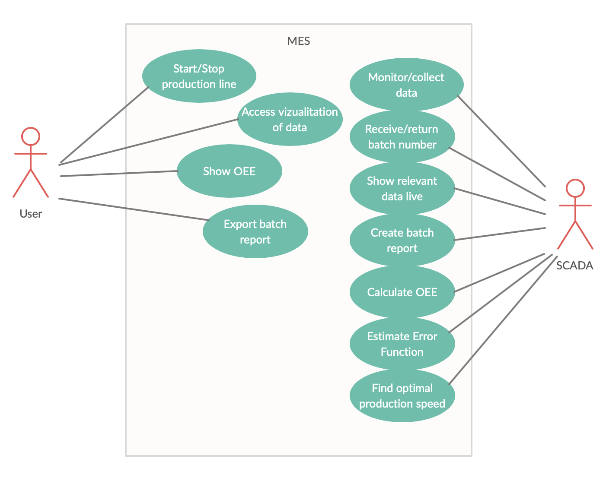
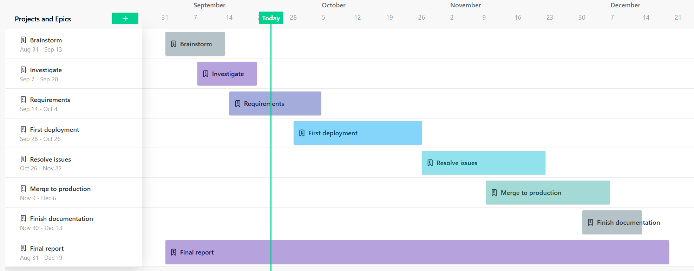
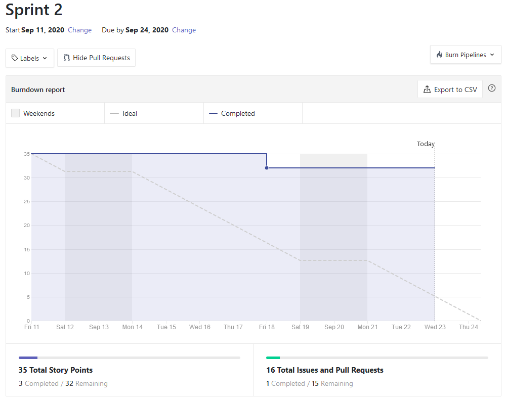

```
NOTE: Rækkefølge
0. Motivation todo
1. Aim
2. Solutions
3. Objectives
4. Initial Requirements TODO
5. Stakeholders
6. Project organisation
7. Project Plan
8. Kevin's Milestones TODO
9. Risks
9. Tentative outline
```
### Motivation

### Aim
This project aims to offer an interactive web interface for monitoring,
controlling and adjusting the brewery machine. This is done by having the web
interface interacting with a REST API that connects to a client that controls
the machine through an OPC-UA server connection and stores relevant data in a 
database.

### Solutions


Our distributed system consists of five sub-systems, where we are writing three
of them.


##### OPC-UA Client
The OPC-UA client is responsible for communicating with the brewing machine via
the OPC-UA server. This is needed in order to send and receive data via
commands.

#### Website
The website user interface is where the client will be able to interface with
our system.

#### REST API
The REST API functions primarily as a gateway in this design, in order for the
front-end to receive data via fetch calls in JavaScript it needs to talk with
something that speaks HTTP and preferably delivers data in JSON.

### Objectives
The group wants to host the REST API and Website on a Linux based server on a
fully-qualified domain name using the container technology Docker which should
be configured via Docker Compose. Furthermore the group aims to setup a
continuous integration pipeline for development and continuous delivery via 
Watchtower.

#### Initial Requirement Analysis

#### Summary of requirements
The groups proposed solution will adhere to the requirements given by the brewery Refslevbæk Bryghus A/S.

The MES must be able to control the brewery’s production. It must be able to start and stop the production line, as well as monitor the production and collect data from the production line. The data must be stored for further analysis.
The MES must be able to keep tract of the batches that the new machine is producing, as well as collect various data from the machine that is associated with the current batch number. After a finished batch production, the MES must be able to produce a batch report of the produced batch. The report must contain the following.
- Batch ID
- Product type
- Amount of products (total, defect and acceptable)
- Amount of time used in the different states
- Logging of temperature over the production time
- Logging of timidity over the production time

The MES/SCADA system must be able to monitor the production and display live relevant data from the machine.
The documentation of the system must contain an illustration that defines the different components in the setup, in relation to the ISA88^1213 Part 1 Physical Hierarchy model. The system must have a visualization that can be accessed and used to display the production data. The system must be able to collect the necessary data from the machine and calculate the OEE^131516 of the machine. The OEE must be available to be displayed by the system. The system must be able to estimate the error function associated with the different products.
The system must be able to find the optimal production speed for each product type, based on an error simulation and the appertaining graph upon which the error simulation is built.

#### List of requirements
| ID  	| Name                     	| Description                                                                                                                                                 	|
|-----	|--------------------------	|-------------------------------------------------------------------------------------------------------------------------------------------------------------	|
| R01 	| Control production line  	| Start/stop production line                                                                                                                                  	|
| R02 	| Monitor production       	| Monitor production (collect data and store said data)                                                                                                       	|
| R03 	| Administer batches       	| Keep track of batches (batch ID)                                                                                                                            	|
| R04 	| Store batch info         	| Collect various data associated with current batch number from machine                                                                                      	|
| R05 	| Batch ID                 	| Receive a batch number and return the batch number when the batch has been completed                                                                        	|
| R06 	| Live data                	| Monitor and display live relevant data from the machine                                                                                                     	|
| R07 	| Batch report             	| Produce a batch report (PDF/dashboard style format)                                                                                                         	|
| R08 	| Documentation            	| Documentation must contain an illustration that defines the different components in the setup in relation to the ISA88^1213 Part 1 Physical Hierarchy model 	|
| R09 	| Visualization            	| Visualization that can be accessed and used to display the production data                                                                                  	|
| R10 	| OEE                      	| Collect necessary data from the machine and calculate the OEE. OEE must be available to be displayed by the system                                          	|
| R11 	| Estimate error function  	| Estimate the error function associated with the products                                                                                                    	|
| R12 	| Optimal Production speed 	| Estimate the optimal production speed for each product type                                                                                                 	|


#### Prioritization of requirements
The group has decided that at the current state, every requirement is a must have. A further prioritization of requirements will occur, when we split the requirements into issues.

#### Use Case Diagram


#### Supplementary Requirements
| FURPS          	| Demands                                                      	|
|----------------	|--------------------------------------------------------------	|
| Functionality  	|                                                              	|
| Usability      	| Documentation on usage of the REST API                       	|
| Reliability    	| On server reboot, the application will automatically restart 	|
| Performance    	| Max response time (API: 400 ms)                              	|
| Supportability 	| Minimum browser versions                                     	|

### Stakeholders
For this project the group does not have any external stakeholders, which is a
problem when developing using SCRUM, since this role is usually filled by a
Product Owner role (abbreviated to PO from here on out). The PO should under
normal circumstances be one from the customers firm, and their job is to choose
which features (user stories) that they would like developed next. Since such a
person does not exist for this project, the group have instead pinpointed
Kristian Nymann Jakobsen to fulfill this role.


### Project Organisation
In this project, work is distributed from planning meetings. These planning
meetings take place at the beginning of each sprint, where the workload is
estimated and distributed across the team members. Kristian Nymann Jakobsen was chosen to be the
Product Owner, so he oversees the “what”, with a focus on value, time to market
etc. Kenneth Munk Christiansen was chosen to be Scrum Master, so he must ensure that the Scrum
framework is understood and is used correctly throughout this project. Like the
rest of the group, they are also a part of the Development Team.

### Project Plan
To be sure that it is feasible to complete the project within the designated
time frame a project plan has been made with inspiration from the
[project plan supplied by the supervisor.](https://docs.google.com/spreadsheets/d/1mZXxgDiwWwWpSyaQmMcafTjvXa2lQriszwTyt-Pf5BA/edit#gid=0)



In this it is shown when the different milestones must be completed to succeed
with the project. As mentioned above, sprints with a duration of two weeks will
be used throughout this project. Each sprint consists of issues from the product
backlog and is chosen at the beginning of each sprint, as de-scribed in section
Methods. To keep track of these sprints, a burn down chart will be made, as seen
below.



This ensures the group that each sprint is successfully completed, and if not,
it is easy to see where it went wrong, and the remaining issues can be
transferred to the next sprint.

### Risks
The group foresees three risks with varying impact levels.

#### Covid-19
| Assessment | Impact | Critical? |
| ---       | ---    | ---       |
| High      | High   | Yes       |

With regulations concerning social distancing and the risk of being infected
with Covid-19, most work will take place from home. To avoid complications,
expectations to finish delegated work to each group member will be raised. Each
member is also expected to follow the lectures. The supervisor will be available
for contact via e-mail, if questions should arise.

#### Schedule
| Assessment | Impact | Critical? |
| ---       | ---    | ---       |
| High      | High   | Yes       |

If the group falls behind schedule, the delegated work tasks will be evaluated.

#### Lost team member
| Assessment | Impact | Critical? |
| ---       | ---    | ---       |
| Medium    | Low    | Yes       |

Since the group has already lost a member, the group is currently undermanned.
To stay on top of the semester project, expectations to finish delegated work to
each member will be raised. Each member is also expected to follow the lectures.

### Milestones

#### About milestones
This is our milestones and activities.  
**Activities** will include scrum planning and meeting.
It will also show some key activities from the school, that are mandatory
and at last it will also show when the project is need to be handed in.  
**Milestones** is the overall structure of the project.
Milestone shows the different phases we are going through.

| Phase                | Activities               | start date | end date | week |
| ---                  | --                       | --         | --       | --   |
| Brainstorm           | Scrum planning (1)       | 28-08-20   |          | 35   |
|                      | kickoff                  | 01-09-20   |          | 36   |
| Investigate          | Scrum meeting            | 04-09-20   |          | 37   |
| Requirements         | Scrum planning (2)       | 11-09-20   |          | 38   |
|                      | Scrum meeting            | 18-09-20   |          | 39   |
| First deployment     | Scrum planning (3)       | 25-09-20   |          | 40   |
|                      | Team leader meeting      | 25-09-20   |          |      |
|                      | Project draft            | 02-10-20   |          |      |
|                      | Peer feedback start      | 05-10-20   | 09-10-20 | 41   |
|                      | Scrum planning (4)       | 09-10-20   |          |      |
|                      | Final project foundation | 18-10-20   |          | 42   |
|                      | Scrum planning (5)       | 23-10-20   |          | 43   |
|                      | Team leader meeting      | 09-10-20   |          |      |
|                      | Project week             | 18-10-20   | 24-10-20 |      |
| Resolve issues       | Scrum meeting            | 30-10-20   |          | 44   |
|                      | Code review              | 30-10-20   |          |      |
|                      | Scrum planning (6)       | 06-11-20   |          | 45   |
|                      | Scrum meeting            | 13-11-20   |          | 46   |
| Merge to production  | Scrum planning (7)       | 20-11-20   |          | 47   |
|                      | Scrum meeting            | 27-11-20   |          | 48   |
| Finish documentation | Scrum planning (8)       | 04-12-20   |          | 49   |
|                      | Scrum meeting            | 11-12-20   |          | 50   |
|                      | Scrum meeting            | 18-11-20   |          | 51   |
|                      | Final report             | 02-12-20   |          |      |


### Tentative outline
The estimated outline of the project report is as follows;

I. Cover(title, information, signatures)  
II. Summary  
III. Preface  
IV. Table of Contents  
V. Editorial(contribution table)  
VI. List of figures  

#### Main report

1. Introduction  
    1. Motivation?  
    1. Problem formulation  
2. Background  
    1. Review of relevant literature and other background information
3. Problem analysis  
    1. Use-case analysis  
    2. Use-case realization  
4. Theory and Methods  
    1. Theory  
    2. Methods  
5. Requirements  
    1. Overall requirements specification  
    2. Selected detailed requirements  
    2.1. Detailed use-cases  
    3. Functional and non-function requirements
    4. The physical setup(brewing machine)
    5. Description of the simulator(mathematical??)
6. Architecture(System architecture)
7. Design
    1. Description of specific parts of the system(what’s important and interesting)
8. Implementation(description of technically complicated parts of the system)
9. Verification and validation(verify, simulate and test that the implemented system fulfils the requirements)
10. Evaluation(Evaluation of the developed product from a user/customer point of view)
11. Conclusion
12. References
Appendix(all technical details that are not essential to understanding the report)(bilag)
